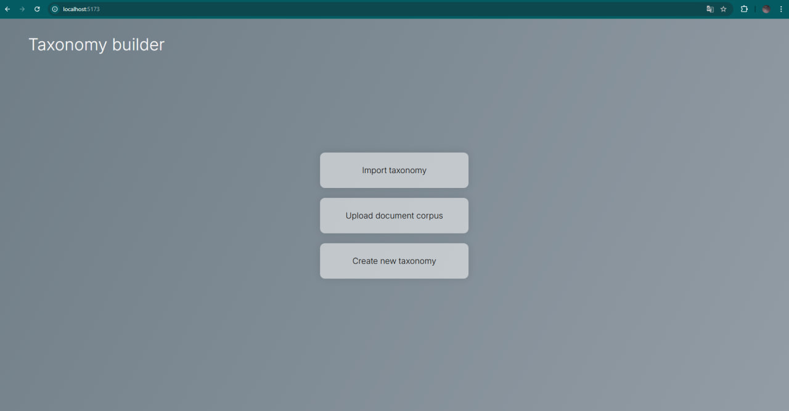
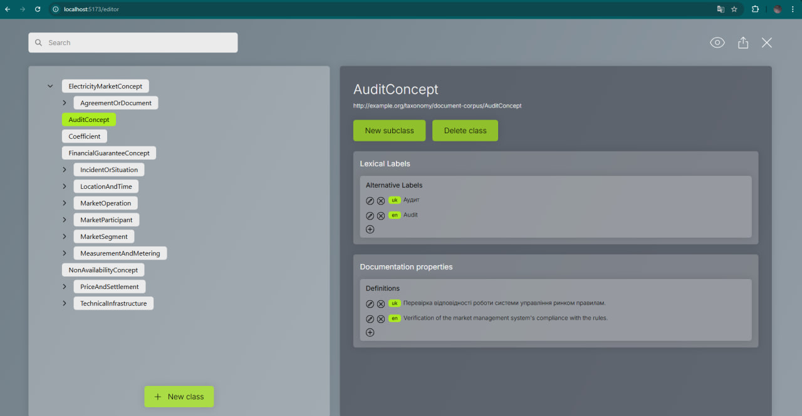
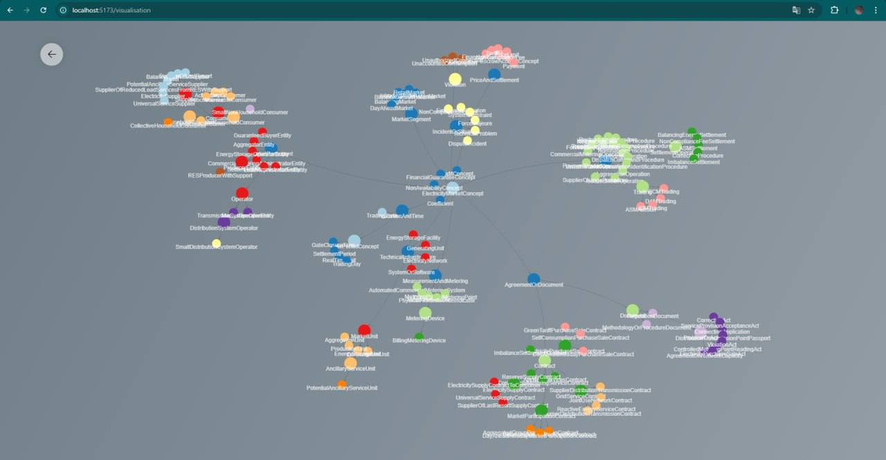

# Taxonomy Builder API & Frontend

---

## 🚀 Screenshots





---

## ✨ Features

*   **Manual Taxonomy Creation & Editing:** Allows for direct creation and modification of taxonomy structures.
*   **Import Existing Taxonomies:** Supports importing pre-existing taxonomies (e.g., from TTL files).
*   **Automatic Taxonomy Generation (LLM-Powered):** Leverages an integrated Large Language Model (LLM) to automatically generate a taxonomy based on an uploaded corpus of documents.
*   **Hierarchical Class & Subclass Management:** Enables the addition of hierarchical classes and subclasses to build out the taxonomy.
*   **Multilingual Attribute Management:** Supports adding, editing, and deleting attributes such as labels and definitions in multiple languages.
*   **Taxonomy Search:** Provides functionality to search within the taxonomy.
*   **Network Graph Visualization:** Visualizes the taxonomy structure as an interactive network graph.
*   **Taxonomy Export:** Allows exporting the generated taxonomy structure for further use, such as in ontology construction.

---

## 🛠️ Tech stack

*   **Backend:**
    *   Python
    *   FastAPI
    *   Uvicorn
    *   Pydantic
*   **Frontend:**
    *   React
    *   Vite
    *   React Router DOM
    *   Tailwind CSS
    *   Axios
    *   React Force Graph 2D
*   **Database:**
    *   GraphDB

---

## ⚙️ Installation & setup

**Backend (FastAPI):**

```bash 
python -m venv .venv
# Windows: .venv\Scripts\activate
# macOS/Linux: source .venv/bin/activate
pip install -r requirements.txt
# Create .env: GEMINI_API_KEY="your_gemini_api_key"
```

**Frontend (React):**

```bash 
npm install
```

---

## 📜 Running the application

**Backend (FastAPI):**

```bash 
uvicorn app.main:app --reload --port 8000
```

**Frontend (React):**

```bash 
npm start
```
